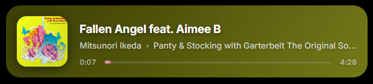

# 🎵 OBS Widget for Pear Desktop

A minimal "Now Playing" widget for OBS Studio that displays the currently playing track from [Pear Desktop](https://github.com/pear-devs/pear-desktop) (a YouTube Music client).

[](https://github.com/pear-devs/pear-desktop)




## Features

- **Auto show/hide** — the widget smoothly appears when music starts playing and fades out after 3 seconds of inactivity (pause, stop, or closing Pear Desktop).
- **Dynamic background** — the widget background color adapts to the album cover art using real-time color extraction.
- **Accent progress bar** — the progress bar color is also derived from the cover palette, picking the brightest accent color.
- **Cover art** — displays the current track's album artwork with rounded corners.
- **Track info** — shows title, artist, and album name.
- **Progress timeline** — elapsed time, duration, and an animated progress bar.
- **Transparent background** — designed to overlay on any OBS scene without a visible background box.

## Requirements

- **Pear Desktop** running with the API server enabled on the default port (`9863`).
- **OBS Studio** (any recent version with Browser Source support).

## Setup

### 1. Enable the Pear Desktop API

Open Pear Desktop → Settings → Integrations → enable **"Companion Server"** (or similar option depending on your version). **Make sure authorization is disabled** in the Companion Server settings — the widget makes unauthenticated requests and will not work if auth is required. Make sure it runs on:

```
http://localhost:9863
```

### 2. Add as OBS Browser Source

1. In OBS, add a new **Browser Source**.
2. Check **"Local file"** and point it to `widget_pear.html`.
3. Set the dimensions:
   - **Width:** `600` (adjust to taste)
   - **Height:** `120`
4. Make sure **"Shutdown source when not visible"** is unchecked so the widget can keep polling.
5. Click **OK**.

> **Tip:** The widget has a transparent background, so it will blend into any scene. Place it in a corner of your stream layout.

## Configuration

You can tweak these constants at the top of the `<script>` section in the HTML file:

| Constant | Default | Description |
|---|---|---|
| `PEAR_API_URL` | `http://localhost:9863/api/v1/song` | Pear Desktop API endpoint |
| `REFRESH_INTERVAL_MS` | `200` | How often to poll the API (in ms) |
| `HIDE_DELAY_MS` | `3000` | Delay before hiding after pause/stop (in ms) |

## How It Works

1. The widget polls the Pear Desktop API every 200ms for the current track info.
2. When a track is playing, the widget fades in with a smooth animation.
3. Album art is loaded and its dominant colors are extracted via canvas:
   - The **darkened dominant color** becomes the widget background gradient.
   - The **brightest accent color** is used for the progress bar.
4. When music is paused, stopped, or Pear Desktop is closed (API unreachable), the widget fades out after the configured delay.

## Troubleshooting

- **Widget never appears:** Make sure Pear Desktop is running with the Companion Server enabled. Check that the API is accessible at `http://localhost:9863/api/v1/song` in your browser.
- **Cover art not loading:** The widget loads thumbnails directly from the URL provided by the API. If images don't appear, check your network/firewall settings.
- **Colors not updating:** Color extraction uses a CORS proxy (`images.weserv.nl`) to read image pixels. If the proxy is down, the widget falls back to the default dark theme.
